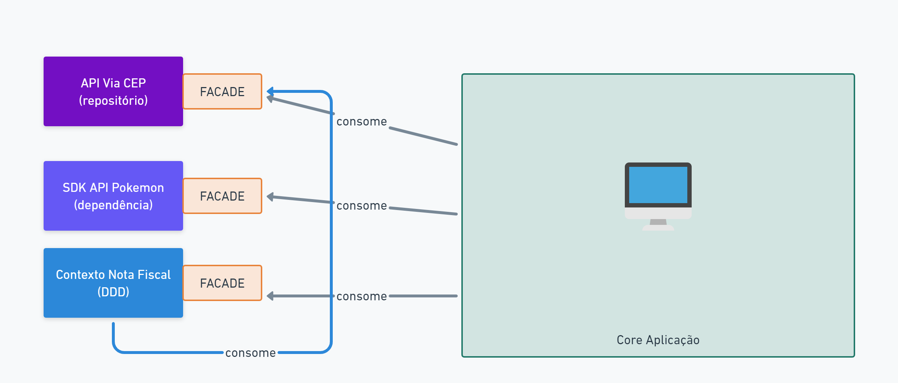

# Criando Projeto e Facades

-   Criando Novo Projeto
<pre> curl -s "https://laravel.build/example-app?with=mysql,redis" | bash</pre>

-   Upar projeto Sail
    <pre>sail up -d</pre>

    -   Comando Alternativo
    <pre> ./vendor/bin/sail up -d</pre>

-   Criar Provider
<pre> php artisan make:provider MyLoggerProvider</pre>

-   Criar Classe `MyLogger` com os métodos que desejo que sejam acessíveis na Facade.

-   Configurar `MyLoggerProvider`, adicionando no método register a seguinte linha:
<pre>$this->app->bind('MyLogger', fn() => new MyLogger);</pre>

-   Criar a Facade em `app/Facades`:
<pre>
class MyLogger extends Facade
{
    protected static function getFacadeAccessor(){
        return 'MyLogger';
    }
}
</pre>

-   Vincular a Provider ao arquivo `config/app.php`. Para isso, devemos adicionar no array `providers` a seguinte linha:
<pre>App\Providers\MyLoggerProvider::class,</pre>

-   Também devemos vicular em Alias no arquivo `config/app.php`. Para isso, devemos adicionar no array `aliases` a seguinte linha:
<pre>'MyLogger' => App\Facades\MyLogger::class,</pre>

# Materias de Apoio

[Doc Laravel Facades](https://laravel.com/docs/9.x/facades#facades-vs-dependency-injection)

